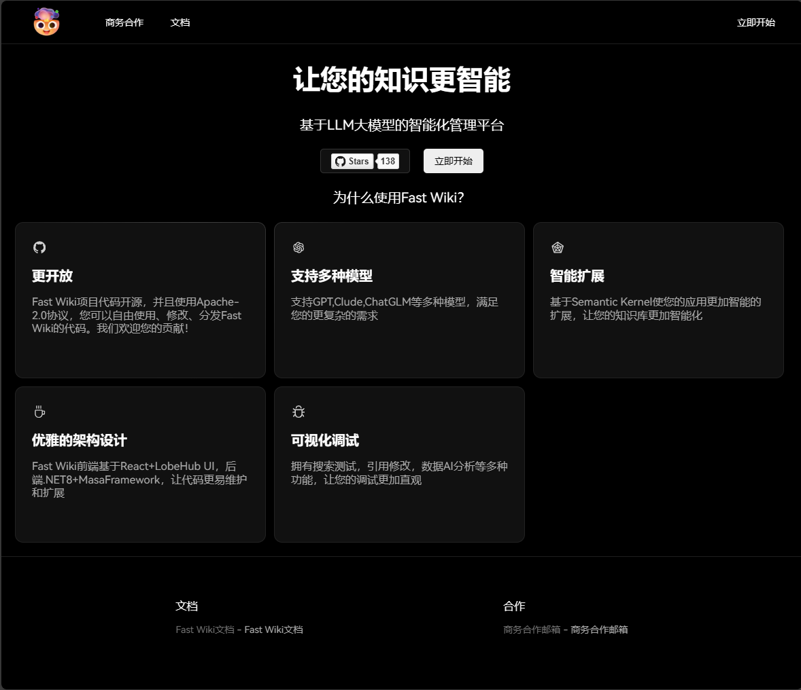
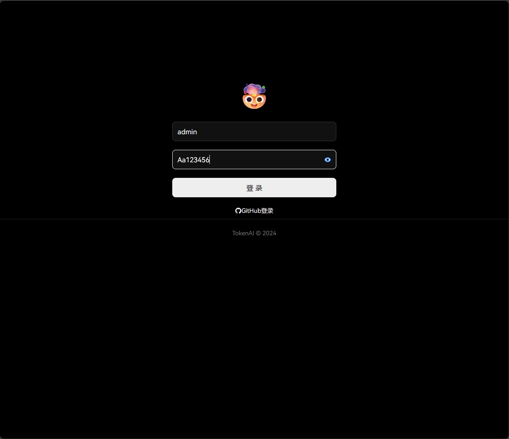
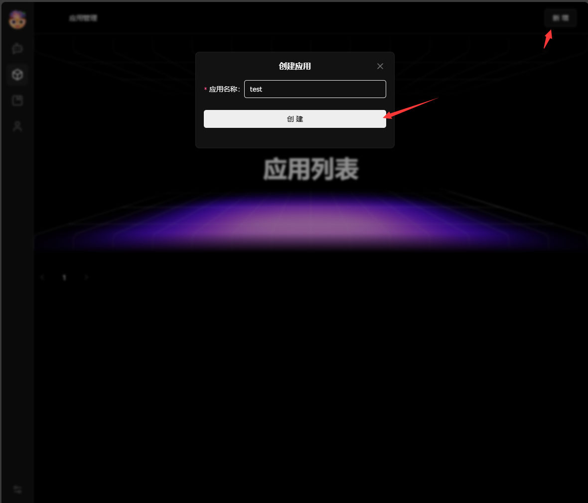
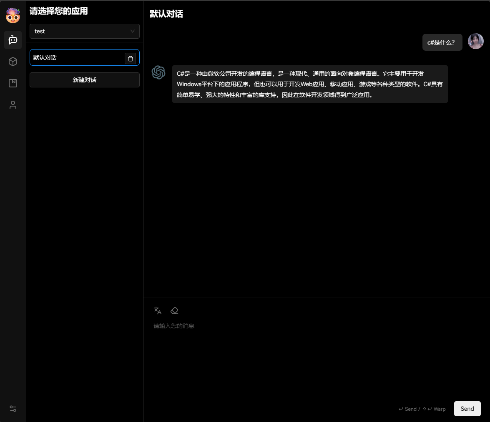

# 快速入门

下载`docker-compose.yml`脚本

```shell
curl https://gitee.com/hejiale010426/fast-wiki/raw/master/docker-compose.yml -O docker-compose.yml
```

下载完成以后会在当前目录下生成一个`docker-compose.yml`文件，当然默认下载的并不能直接使用，我们使用nano编辑文件的内容：

```shell
nano docker-compose.yml
```

文件大概内容如下 ，如果你有代理的话则修改`OPENAI_CHAT_ENDPOINT`和`OPENAI_CHAT_EMBEDDING_ENDPOINT`的地址为你的代理地址，格式是 `http://ip:端口`即可，然后`OPENAI_CHAT_TOKEN`需要提供您的OpenAI的Key或您的代理的Token，其他的都默认即可，`ASPNETCORE_ENVIRONMENT=Development`则会自动迁移数据库，并且下一个版本的更新也会自动更新，第一次执行务必使用。

```yml
version: '3.8'  # 可以根据需要使用不同的版本
services:
  fast-wiki-service:
    image: registry.cn-shenzhen.aliyuncs.com/fast-wiki/fast-wiki-service
    container_name: fast-wiki-service
    user: root
    restart: always
    ports:
      - "8080:8080"
    build: 
      context: .
      dockerfile: ./src/Service/FastWiki.Service/Dockerfile
    depends_on:
      - postgres
    volumes:
      - ./wwwroot/uploads:/app/wwwroot/uploads
    environment:
      - OPENAI_CHAT_ENDPOINT=https://api.openai.com
      - OPENAI_CHAT_EMBEDDING_ENDPOINT=https://api.openai.com
      - OPENAI_CHAT_TOKEN=您的TokenKey
      - OPENAI_CHAT_MODEL=gpt-3.5-turbo
      - OPENAI_EMBEDDING_MODEL=text-embedding-3-small
      - ASPNETCORE_ENVIRONMENT=Development

  postgres: # 当前compose服务名
    image: registry.cn-shenzhen.aliyuncs.com/fast-wiki/pgvector:v0.5.0 # 拉取的数据库镜像
    container_name: postgres  # 容器运行的容器名称
    restart: always  # 开机自启动
    environment:  # 环境变量
      POSTGRES_USER: token  # 默认账号
      POSTGRES_PASSWORD: dd666666 # 默认密码
      POSTGRES_DB: wiki # 默认数据库
      TZ: Asia/Shanghai  # 数据库时区
    volumes:
      - ./postgresql:/var/lib/postgresql/data # 将PostgreSql数据持久化
```

修改完上面的配置然后将容器执行启来：

```
docker-compose up -d
```

然后我们访问启用的访问的端口 `http://ip:8080`， 进入首页以后点击立即开始。



然后登录系统，默认的账号 `admin `密码`Aa123456`，登录成功以后再点击立即开始，则进入首页。



然后点击右上角的新增，输入测试应用名称，添加完成，点击左边菜单的第一个对话。



进入对话就可以于AI进行对话了：



上面只是简单的入门了FastWiki的对话功能，更多功能可以自行搭建测试。
