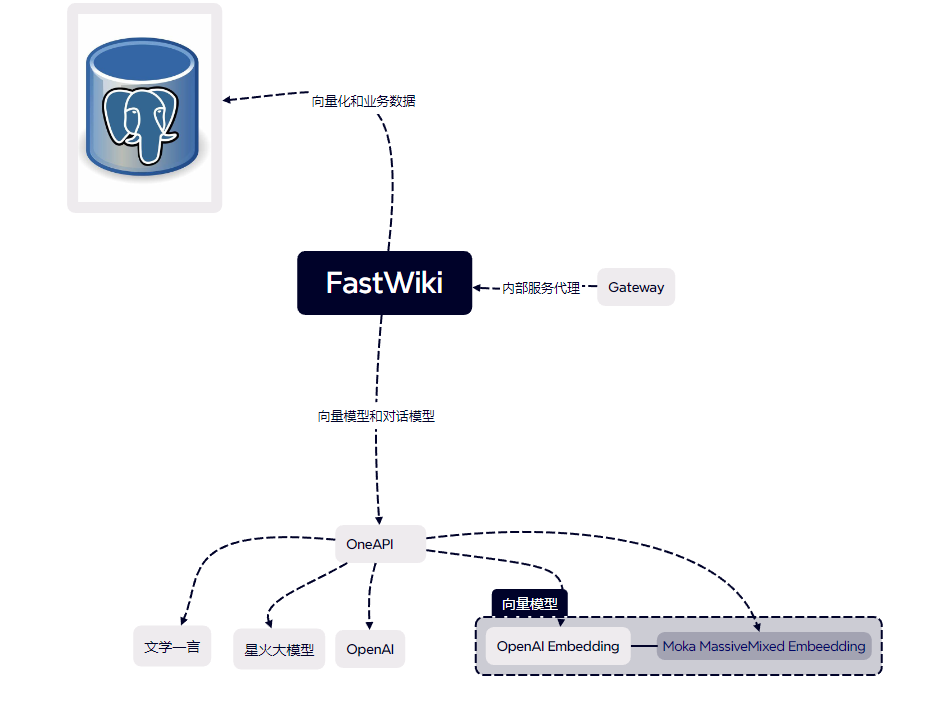

# 接入微软、ChatGLM、本地模型等

部署和接入 OneAPI，实现对各种大模型的支持

- 默认情况下，FastGPT 只配置了 GPT 的模型，如果你需要接入其他模型，需要进行一些额外配置。
- [One API](https://github.com/songquanpeng/one-api) 是一个 OpenAI 接口管理 & 分发系统，可以通过标准的 OpenAI API 格式访问所有的大模型，开箱即用。
- FastGPT 可以通过接入 OneAPI 来实现对不同大模型的支持。OneAPI 的部署方法也很简单。

## FastWiki 与 [OneAPI](https://github.com/songquanpeng/one-api) 关系



## 使用docker部署

使用 SQLite 的部署命令

```shell
docker run --name one-api -d --restart always -p 3000:3000 -e TZ=Asia/Shanghai -v /home/ubuntu/data/one-api:/data justsong/one-api
```

使用 MySQL 的部署命令，在上面的基础上添加 `-e SQL_DSN="root:123456@tcp(localhost:3306)/oneapi"`，请自行修改数据库连接参数，不清楚如何修改请参见下面环境变量一节

```shell
docker run --name one-api -d --restart always -p 3000:3000 -e SQL_DSN="root:123456@tcp(localhost:3306)/oneapi" -e TZ=Asia/Shanghai -v /home/ubuntu/data/one-api:/data justsong/one-api
```
